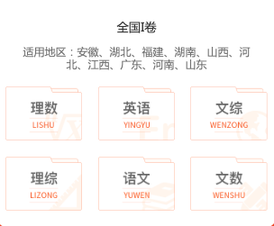

> 井字形自适应布局
> author: @TiffanysBear

### 需求背景
高考活动页面需要在一个页面容器中，实现一个两行三列宽度自适应缩放，且图片等比例缩放，随着浏览器宽度进行自适应缩放的布局。
中间的图片需要自适应，随着页面宽度的变化，三等分缩放，图片等比例缩放。

### 解决办法一：flex布局 + padding-bottom
解决思路：
1. 使用flex弹性布局，使子元素成为容器成员
2. 父元素使用flex-wrap: wrap;将flex 元素 被打断到多个行中

> **CSS flex-wrap** 指定 flex 元素单行显示还是多行显示 。如果允许换行，这个属性允许你控制行的堆叠方向。取值如下：
> **nowrap**
flex 的元素被摆放到到一行，这可能导致溢出 flex 容器。 cross-start  会根据 flex-direction 的值 相当于 start 或 before。
**wrap**
flex 元素 被打断到多个行中。cross-start 会根据 flex-direction 的值选择等于start 或before。cross-end 为确定的 cross-start 的另一端。
**wrap-reverse**
和 wrap 的行为一样，但是 cross-start 和 cross-end 互换。

3、巧妙使用padding-bottom，为子元素设置高度

> **padding-bottom** 属性设置元素的下内边距（底部空白），因为padding-bottom计算的基准值是以父元素的宽度来进行的。
> 该属性设置元素下内边距的宽度。行内非替换元素上设置的下内边距不会影响行高计算，因此，如果一个元素既有内边距又有背景，从视觉上看可能延伸到其他行，有可能还会与其他内容重叠。不允许指定负内边距值。
> 
> |||
> |值|描述|

